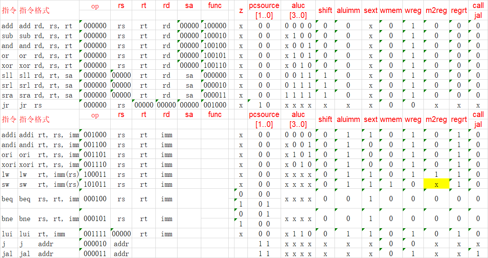
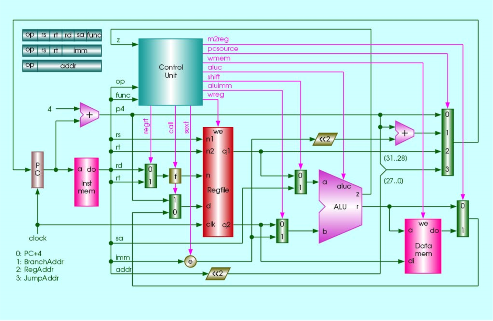
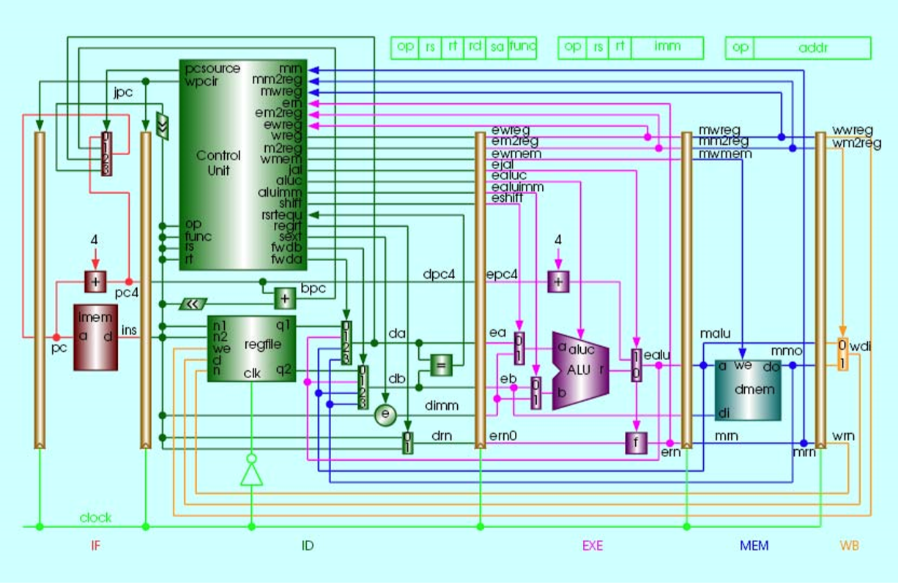

# EI332
Source code for three experiments of course EI332 in SJTU.

## Some Important Graphs

## Some Useful Files

If you forget how to create a project or have no idea about what to do next, see [My_First_Fpga](./course/My_First_Fpga.pdf). If you don't know how to assign pins, see [DE1-SoC_User_manual](./course/DE1-SoC_User_manual.pdf).

## Some Notes

If the modelsim can't find xx_insmem.mif and xx_datamem.mif you can add a directory in simulation/modelsim, name it source and put the two files in it.

